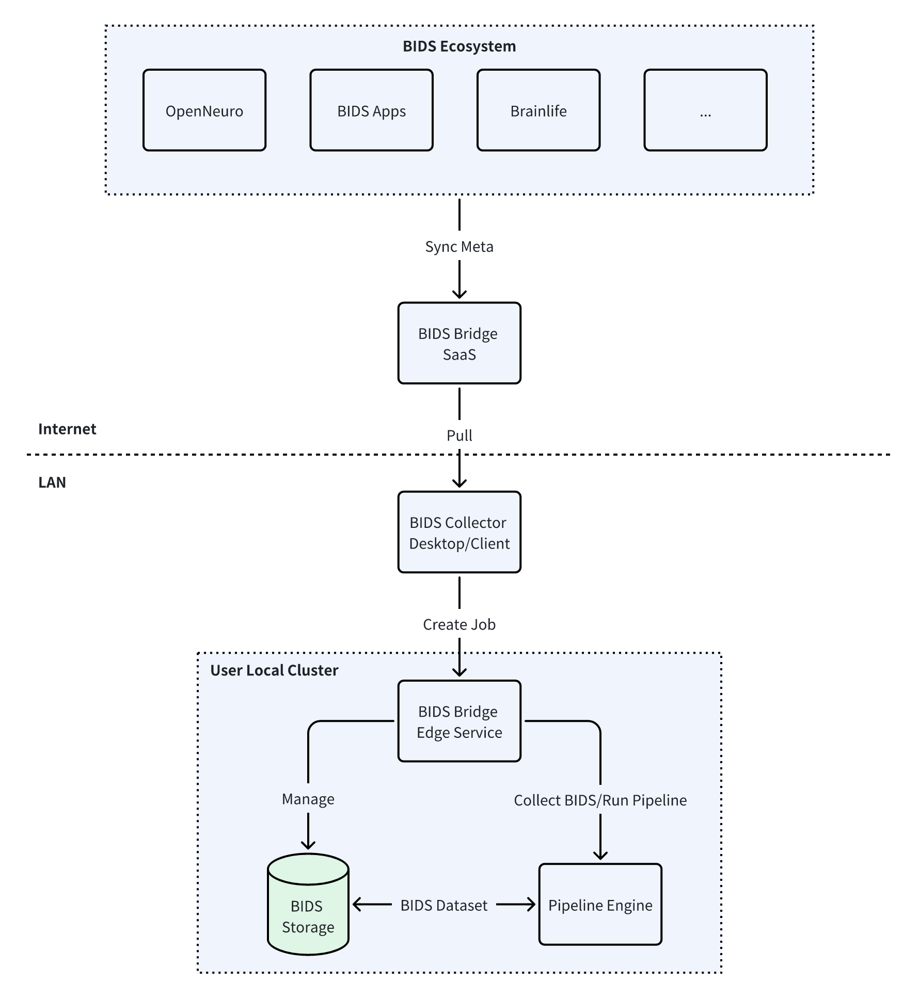

# BIDS-Bridge

Bridge BIDS data and pipeline

- BIDS dataset collected from [OpenNeuro](https://www.openneuro.org) etc.
- BIDS App collected from [BIDS Apps](https://bids-apps.neuroimaging.io/) etc.
- Local-first data storage and computing
- Customize pipeline engine, [Argo Workflow](https://argoproj.github.io/workflows/)/[Docker](https://www.docker.com)/[GitLab CI Local](https://github.com/firecow/gitlab-ci-local) etc.



## Quick Start

- ***Default credentials in [docker-compose.yml](docker-compose.yml) is weak and insecure, just for having a quick view of project.***

- ***Uncomment the ports config of bids-bridge and bids-bridge-ui service for exposing the service API.***

```bash
docker-compose up
```

## OpenAPI (Draft)

[OpenAPI-Client-Stub](./client-stub.rest)

## Public Resources

### OpenNeuro Dataset

[Scraper Code](src/main/resources/openneuro/openneuro-scrap.ipynb)

<!-- [](https://colab.research.google.com/drive/15zr9x_tYsGrjU3RUvSrNsTI5PaCdpxGh#scrollTo=10UsHTCvTJmG) -->

### BIDS Apps

[Scraper Code](src/main/resources/bids-apps/bids-apps-scrap.ipynb)

<!-- [](https://colab.research.google.com/drive/15zr9x_tYsGrjU3RUvSrNsTI5PaCdpxGh#scrollTo=10UsHTCvTJmG) -->
